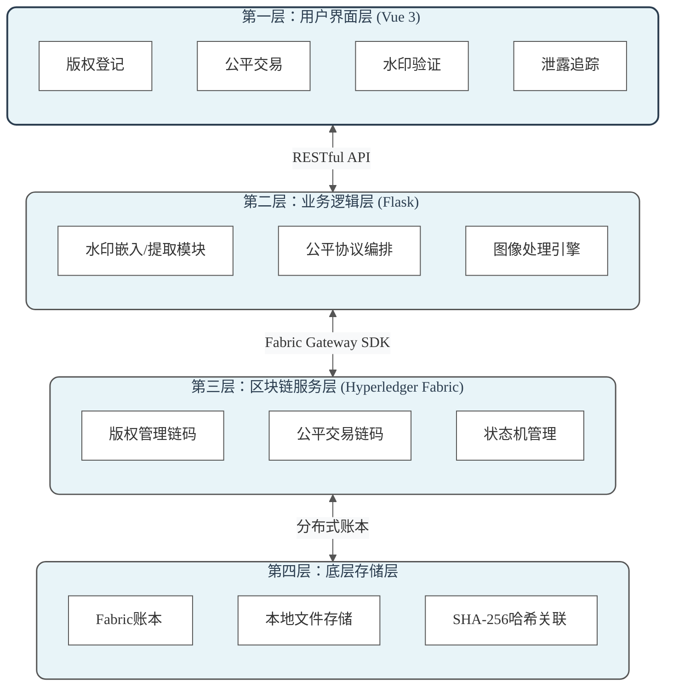

```mermaid
%%{init: {'theme': 'base', 'themeVariables': { 'primaryColor': '#fff', 'edgeLabelBackground':'#f8f9fa', 'tertiaryColor': '#fff', 'fontFamily': 'Helvetica, Arial, sans-serif', 'nodeBorder': '#333', 'lineColor': '#555', 'textColor': '#333'}}}%%
graph TD
    %% 定义学术风格类
    classDef layer fill:#e8f4f8,stroke:#2c3e50,stroke-width:2px,rx:10,ry:10,color:#2c3e50;
    classDef module fill:#ffffff,stroke:#555,stroke-width:1px,color:#333;
    classDef arrow stroke:#555,stroke-width:1.5px;

    %% 第一层
    subgraph L1 ["第一层：用户界面层 (Vue 3)"]
        direction TB
        M1[版权登记]:::module
        M2[公平交易]:::module
        M3[水印验证]:::module
        M4[泄露追踪]:::module
    end
    L1:::layer

    %% 第二层
    subgraph L2 ["第二层：业务逻辑层 (Flask)"]
        direction TB
        M5[水印嵌入/提取模块]:::module
        M6[公平协议编排]:::module
        M7[图像处理引擎]:::module
    end
    L2:::layer

    %% 第三层
    subgraph L3 ["第三层：区块链服务层 (Hyperledger Fabric)"]
        direction TB
        M8[版权管理链码]:::module
        M9[公平交易链码]:::module
        M10[状态机管理]:::module
    end
    L3:::layer

    %% 第四层
    subgraph L4 ["第四层：底层存储层"]
        direction TB
        M11["Fabric账本"]:::module
        M12["本地文件存储"]:::module
        M13["SHA-256哈希关联"]:::module
    end
    L4:::layer

    %% 连接
    L1 <-->|RESTful API| L2:::arrow
    L2 <-->|Fabric Gateway SDK| L3:::arrow
    L3 <-->|分布式账本| L4:::arrow
```