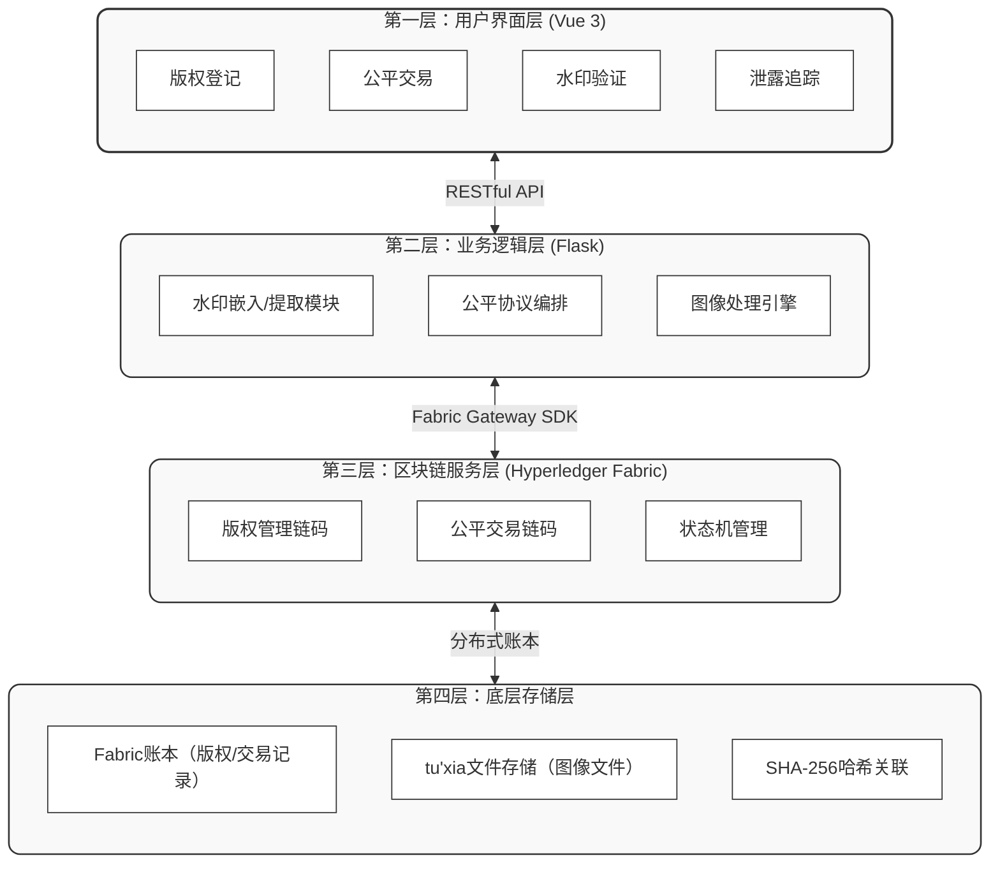

```mermaid
graph TD
    %% 定义样式类
    classDef layerStyle fill:#f9f9f9,stroke:#333,stroke-width:2px,rx:10,ry:10;
    classDef subModuleStyle fill:#ffffff,stroke:#333,stroke-width:1px;
    classDef arrowStyle stroke:#333,stroke-width:1.5px;

    %% 第一层：用户界面层
    subgraph Layer1 ["第一层：用户界面层 (Vue 3)"]
        direction TB
        M1[版权登记]:::subModuleStyle
        M2[公平交易]:::subModuleStyle
        M3[水印验证]:::subModuleStyle
        M4[泄露追踪]:::subModuleStyle
    end
    Layer1:::layerStyle

    %% 第二层：业务逻辑层
    subgraph Layer2 ["第二层：业务逻辑层 (Flask)"]
        direction TB
        M5[水印嵌入/提取模块]:::subModuleStyle
        M6[公平协议编排]:::subModuleStyle
        M7[图像处理引擎]:::subModuleStyle
    end
    Layer2:::layerStyle

    %% 第三层：区块链服务层
    subgraph Layer3 ["第三层：区块链服务层 (Hyperledger Fabric)"]
        direction TB
        M8[版权管理链码]:::subModuleStyle
        M9[公平交易链码]:::subModuleStyle
        M10[状态机管理]:::subModuleStyle
    end
    Layer3:::layerStyle

    %% 第四层：底层存储层
    subgraph Layer4 ["第四层：底层存储层"]
        direction TB
        M11["Fabric账本（版权/交易记录）"]:::subModuleStyle
        M12["tu'xia文件存储（图像文件）"]:::subModuleStyle
        M13["SHA-256哈希关联"]:::subModuleStyle
    end
    Layer4:::layerStyle

    %% 连接关系
    Layer1 <-->|RESTful API| Layer2:::arrowStyle
    Layer2 <-->|Fabric Gateway SDK| Layer3:::arrowStyle
    Layer3 <-->|分布式账本| Layer4:::arrowStyle
```